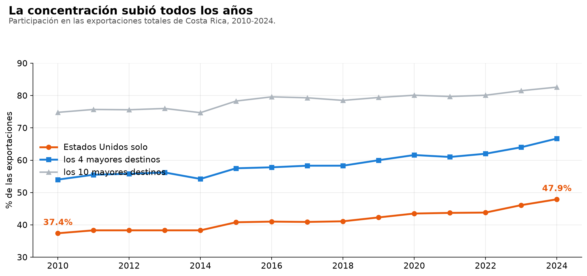
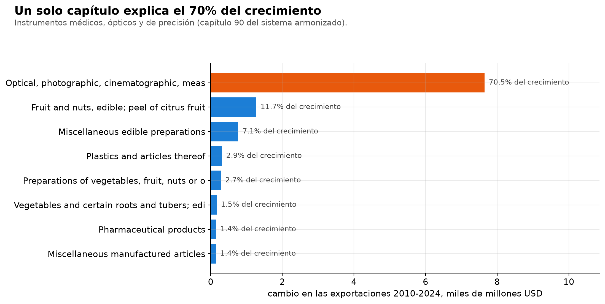
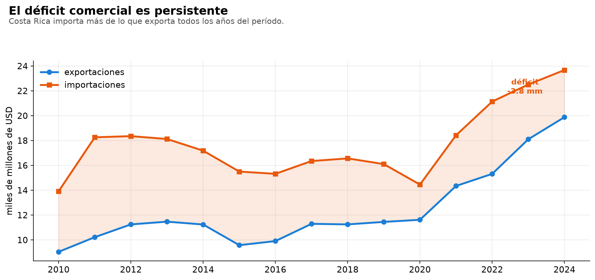

# El comercio exterior de Costa Rica se concentró, no se diversificó

*[English version](README.en.md)*

**Entre 2010 y 2024 las exportaciones ticas se duplicaron con creces. Y al mismo
tiempo se volvieron mucho más dependientes de un solo país y de un solo
producto.**

| | 2010 | 2024 |
|---|---:|---:|
| Exportaciones totales | $9,04 mm | **$19,9 mm** |
| Destinado a Estados Unidos | 37,4 % | **47,9 %** |
| Concentrado en 4 destinos | 54,0 % | **66,7 %** |
| Índice Herfindahl de destinos | 0,160 | **0,248** |



Y el crecimiento tiene un solo autor: el **capítulo 90 del sistema armonizado**
—instrumentos médicos, ópticos y de precisión— pasó de $1.100 M a $8.750 M y
explica por sí solo el **70,5 %** de todo el aumento exportador del período.



Un producto, a un país. Esa es la exposición real del sector externo
costarricense, y no se ve mirando el total.



## Correr

```bash
pip install pandas requests openpyxl
python 01_bajar.py      # API de UN COMTRADE (cacheada)
python 02_analizar.py   # los hallazgos
python 03_excel.py      # el libro de Excel
python 05_powerbi.py    # el modelo para Power BI
```

## Qué hay

| Archivo | Qué es |
|---|---|
| `01_bajar.py` | ingesta desde UN COMTRADE, con caché y reintento ante HTTP 429 |
| `02_analizar.py` | concentración (Herfindahl y top-N), dependencia y aporte por capítulo |
| `03_excel.py` | libro de Excel **con fórmulas vivas**, no valores pegados |
| `04_power_query.m` | la misma ingesta en lenguaje M, para refrescar desde Excel |
| `05_powerbi.py` | modelo dimensional y 10 medidas DAX para Power BI |
| `06_figuras.py` | las tres figuras de este README |
| `Comercio_exterior_CR.xlsx` | el entregable de Excel |

## El libro de Excel

La hoja **Resumen** no trae números pegados: cada celda es un `SUMIFS` o un
`COUNTIFS` sobre las hojas de datos. Se cambia el año en la celda amarilla y
todo se recalcula. Eso es un modelo; un reporte con valores pegados no lo es.

Trae también la serie de concentración con su gráfico y el desglose por capítulo.

## Power Query

`04_power_query.m` va directo contra la API: se pega en el Editor avanzado de
Excel y la tabla se refresca con un botón, sin volver a correr Python.

## Lo que costó averiguar de la API

Nada de esto está claro en la documentación; salió de probarla:

- `partnerCode='all'` devuelve **HTTP 400**. Hay que **omitir** el parámetro.
- El endpoint `preview` corta en **500 registros** por respuesta, así que se pide
  una combinación de año y flujo por vez.
- **No devuelve los nombres.** `partnerDesc` y `cmdDesc` vienen en `null`: los
  nombres salen de los catálogos de referencia, que son otro endpoint.
- Limita por frecuencia con **HTTP 429**. El bajador espera de forma creciente y
  cachea cada respuesta, así que la segunda corrida no pide nada.

## Nota metodológica

El código de socio `0` es «el mundo»: es el total, no un socio. Los agregados
regionales (`es_agregado`) tampoco son países. Sumarlos junto a los países
contaría el comercio dos veces, así que se excluyen de todo cálculo de
concentración y del modelo de Power BI.

## Datos

UN COMTRADE, público y sin llave. Costa Rica es el reporter 188. 2010-2024.
